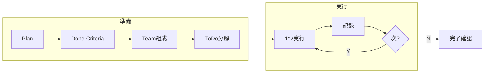
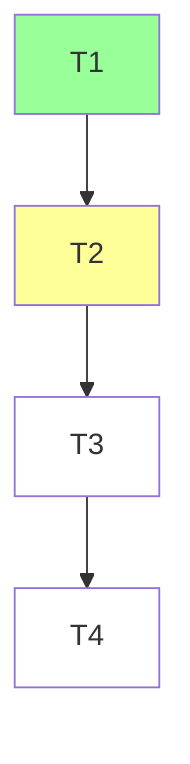

# Workflow



## Climpt Workflow 尊重

`.agent/workflow.json` に定義された6段階パイプラインを尊重する。

```
analysis → planning → execution → verification → finalize → instruction
```

- 各フェーズには担当エージェント（analyst, architect, writer, reviewer, facilitator, impl-director）が割り当てられている
- フェーズ遷移・優先順位・ラベルマッピングは `workflow.json` の定義に従う
- climpt workflow プロンプト（`.agent/climpt/prompts/workflows/`）が提供する操作（analyze, create, resolve, validate 等）を活用する
- 作業がどのフェーズに該当するかを意識し、対応するエージェントの責務範囲内で行動する

## Rules

| #  | 指示                                                                                                       |
| -- | ---------------------------------------------------------------------------------------------------------- |
| 1  | `tmp/<task>/`に plan.md, progress.md, analysis.md を書き出す（思考の外部化）                               |
| 2  | 1つ完了→記録→次。同時並行しない                                                                            |
| 3  | Plan(全体像)を TaskCreate で ToDo(実行単位)に分解                                                          |
| 4  | plan.md に Team テーブル記載。1Role=1目的、混合禁止（「調査して実装」はNG）。独立RoleはTask toolで並列起動 |
| 5  | 調査はSubAgentへ委譲: 探索=Explore / 設計=Plan / 実行・検証=general-purpose                                |
| 6  | Done Criteria を先に定義。全項目達成まで未完了                                                             |
| 7  | 完了即 progress.md に記録（形式は後述）                                                                    |
| 8  | 技術的に明確→自分で判断し聞かない。方針判断→選択肢+推奨を提示（「どうしますか？」禁止）                    |
| 9  | 分析・依存関係は Mermaid で analysis.md に図示。ToDo全体もMermaidでプロットし現在地を色分け                |
| 10 | 詳細手順は専門skillに委譲。方向不明時は `thinking-method` skill                                            |

---

## tmp/構造

```
tmp/<task>/
├── plan.md        # Goal, Done Criteria, Team, Approach, Scope
├── progress.md    # 記録蓄積
├── analysis.md    # Mermaid図
└── investigation/ # SubAgent結果
```

## Planテンプレート

```markdown
# Plan: <タスク名>

## Goal

## Done Criteria

- [ ] <チェック可能な条件>

## Team

| Role | 目的 | Agent Type | 担当ToDo |
| ---- | ---- | ---------- | -------- |

## Approach

## Scope

やること: / やらないこと:
```

## skill文書の作成・改善

→ token圧縮は `prompt-compression` skill

## progress.md 記録

ToDo完了ごとに追記。What/Why(判断根拠)とHow(手順)は分離する。

```markdown
### T1: <タスク名>

**What/Why** - <目的・理由>
**How** - <手順・ツール・出力先>
**Result** - [x] YYYY-MM-DD HH:MM <事実>
```

## ToDoマッピング例



## 質問テンプレート

```markdown
## 確認: <テーマ>

| 案                        | 概要 | メリット | デメリット |
| ------------------------- | ---- | -------- | ---------- |
| A（推奨）                 |      |          |            |
| B                         |      |          |            |
| → A案で進めてよいですか？ |      |          |            |
```
