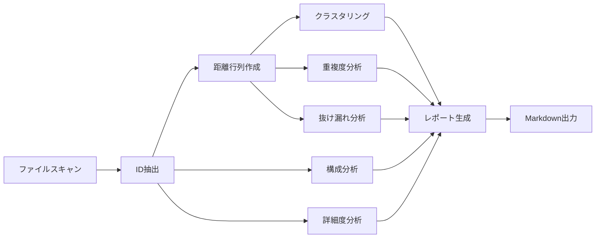

# 分析レポートモード設計

## 概要

トレーサビリティIDの文書品質を4つの観点から分析し、改善レポート（Markdown）を生成する。

## データフロー



## モジュール構成

```
src/modes/
└── analyze.ts        # 4観点の分析ロジック + レポート生成
analyze.ts            # CLIエントリポイント
```

## 4観点の分析フレームワーク

### 1. 構成分析（Structure Analysis）

Level×Scope の網羅性を評価する。

- **Level×Scopeカバレッジマトリクス**: 各 (scope, level) 組の存在数
- **カバレッジ率**: inv を除く全 (scope, level) 組のうち、ID が存在する割合
  - A (≥80%), B (≥60%), C (≥40%), D (<40%)
- **トレーサビリティチェーン**: req → us/spc → dsg の階層完成度
  - 完全 / 部分 / 上位欠損 / 欠損
- **ファイル別ID分布**: 高密度 (>50), 標準 (3-50), 低密度 (<3), ID無し

#### Level分類

| カテゴリ | Level値            |
| -------- | ------------------ |
| 上位     | req, nfr, frq      |
| 下位     | us, spc, spec, dsg |
| 独立     | inv                |

### 2. 詳細度分析（Detail Analysis）

仕様展開の充実度を評価する。

- **スコープ別展開率**: 下位level数 / 上位level数
  - A (≥0.7), B (≥0.5), C (≥0.3), D (<0.3)
- **バージョン鮮度**: 最新日付から30日以内のIDの割合
  - version フィールドの YYYYMMDD をパース
  - A (≥80%), B (≥60%), C (≥40%), D (<40%)
- **レベル別バランス**: 各 level の ID 数と req 比

### 3. 重複度分析（Duplication Analysis）

近似IDと冗長性を検出する。

- **近似IDペア**: 距離行列で distance < 0.1 のペア検出
  - 同scope同level / 同scope異level / 異scope同level / 異scope異level
  - A (<1%), B (<3%), C (<5%), D (≥5%)
- **ファイル横断重複**: 同一IDが複数ファイルに出現するケース
- **統合推奨**: HIGH (同scope同level で距離 < 0.05), MEDIUM (3ファイル以上重複)

### 4. 抜け漏れ分析（Gap Analysis）

欠けている定義と孤立要素を検出する。

- **レベル欠損**: scope 内で期待される level の欠如
  - CRITICAL: 下位があるのに req がない
  - HIGH: req があるのに us/spc がない
  - MEDIUM: spc があるのに dsg / spec がない
- **孤立スコープ**: 1つの level しかない scope
- **低連結ノード**: グラフ中のエッジ数が中央値の25%未満のノード
- **ギャップマップ**: 全 scope × 全 chain level のマトリクス（●/◐/○）

## レポート構成

1. **ヘッダー**: 生成日時, 対象ディレクトリ, 統計情報
2. **サマリー**: 6指標の一覧テーブル（観点, メトリクス, 値, 評価）
3. **構成分析**: カバレッジマトリクス, チェーン, ファイル分布
4. **詳細度分析**: 展開率, バージョン鮮度, レベルバランス
5. **重複度分析**: 近似ペア, ファイル横断重複, 統合推奨
6. **抜け漏れ分析**: レベル欠損, 孤立スコープ, 低連結, ギャップマップ
7. **改善アクション**: 優先度順（CRITICAL > HIGH > MEDIUM > LOW）

## CLIオプション

| オプション         | 説明                       | デフォルト              | 値                                            |
| ------------------ | -------------------------- | ----------------------- | --------------------------------------------- |
| `--output`         | 出力レポートファイルパス   | `tmp/analyze-report.md` | ファイルパス                                  |
| `--distance`       | 距離計算手法               | `structural`            | levenshtein, jaro-winkler, cosine, structural |
| `--algorithm`      | クラスタリングアルゴリズム | `hierarchical`          | hierarchical, kmeans, dbscan                  |
| `--threshold`      | クラスタリング閾値         | `0.3`                   | 数値                                          |
| `--edge-threshold` | 連結度分析の閾値           | `0.5`                   | 数値                                          |
| `--k`              | K-Meansクラスタ数          | `0` (自動)              | 数値                                          |
| `--epsilon`        | DBSCAN近傍半径             | `0.3`                   | 数値                                          |
| `--min-points`     | DBSCAN最小ポイント数       | `2`                     | 数値                                          |

## 使用例

```bash
# 基本
deno run --allow-read --allow-write analyze.ts ./data

# 出力先指定
deno run --allow-read --allow-write analyze.ts ./data --output tmp/report.md

# 細粒度クラスタリングで分析
deno run --allow-read --allow-write analyze.ts ./data --threshold 0.2
```

## 評価グレード基準

| グレード | 意味                          |
| -------- | ----------------------------- |
| A        | 良好 — 改善不要               |
| B        | 概ね良好 — 軽微な改善推奨     |
| C        | 要改善 — 対応計画の策定を推奨 |
| D        | 問題あり — 早急な対応が必要   |
