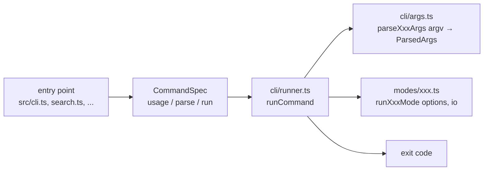

# アーキテクチャ設計

## 概要

Pure TypeScript で実装し、アルゴリズムを切り替え可能な設計とする。

## モジュール構成

```
src/
├── core/
│   ├── types.ts              # 共通型定義
│   ├── id.ts                 # ID文法（パターン・解析・バージョン比較）の唯一の定義
│   ├── errors.ts             # TraceabilityError / ErrorDetail / 終了コード
│   ├── options.ts            # オプション語彙（const タプル）とパーサー
│   ├── events.ts             # ModeEvent / ModeIO / consoleIO
│   ├── io.ts                 # 型付きエラー付きのファイル読み書き
│   ├── relations.ts          # 関係（derived_from / trace_to）の種別・宣言・警告の型
│   ├── extractor.ts          # ID抽出
│   ├── extractor-cli.ts      # rg + sort による高速抽出（外部コマンド）
│   └── scanner.ts            # ファイルスキャン（複数パス・拡張子指定）
├── distance/
│   ├── calculator.ts         # 距離計算インターフェース
│   ├── levenshtein.ts        # レーベンシュタイン距離
│   ├── jaro_winkler.ts       # ジャロ・ウィンクラー距離
│   ├── cosine.ts             # コサイン類似度
│   └── structural.ts         # 構造的類似度
├── clustering/
│   ├── algorithm.ts          # クラスタリングインターフェース
│   ├── hierarchical.ts       # 階層的クラスタリング
│   ├── kmeans.ts             # K-Means
│   └── dbscan.ts             # DBSCAN
├── search/
│   └── similarity.ts         # 類似度検索実装
├── extract/
│   ├── context.ts            # コンテキスト抽出
│   ├── resolver.ts           # 要求IDの解決（バージョン省略IDの latest / all）
│   └── loader.ts             # ID一覧の読み込み（IdsSource）
├── relations/
│   ├── extract.ts            # 関係の抽出（YAML 領域・起点・値）
│   ├── resolve.ts            # 解決（版・存在）と broken の理由（NodeMissing / VersionMissing）
│   └── select.ts             # 要求 ID と向き（in / out）による宣言の選択
├── list/
│   └── aggregator.ts         # List mode の集約・バッチ分割
├── visualization/            # Graph mode（MDS, グラフデータ, HTML）
├── formatter/
│   ├── formatter.ts          # 出力フォーマッター
│   ├── list_formatter.ts     # List mode 用フォーマッター
│   ├── relations_formatter.ts # Relations mode 用フォーマッター
│   └── simple.ts             # シンプル形式
├── modes/
│   ├── pipeline.ts           # 共通ステップ（collectIds / emitResult）
│   ├── cluster.ts            # 各モードの実行関数 runXxxMode(options, io)
│   ├── search.ts
│   ├── extract.ts
│   ├── graph.ts
│   ├── analyze.ts
│   ├── list.ts
│   ├── relations.ts
│   └── modes.scenario.test.ts # given/when/then シナリオテスト
├── cli/
│   ├── args.ts               # 純粋な引数パーサー（argv → ParsedArgs）
│   ├── runner.ts             # 実行ドライバー（エラー → 終了コード）
│   ├── distance-factory.ts   # 距離計算器の生成
│   └── clustering-factory.ts # クラスタリングアルゴリズムの生成
├── testing/
│   └── scenario.ts           # シナリオテスト基盤（JSR公開対象外）
├── cli.ts                    # CLIエントリポイント（cluster mode）
└── mod.ts                    # ライブラリエントリポイント（`./mod` として export）
```

ルート直下の `search.ts` / `extract.ts` / `graph.ts` / `analyze.ts` / `list.ts` /
`relations.ts` が各モードのエントリポイント（JSR サブパス）である。
issue の受け入れ基準は `src/cli/issues.test.ts` が、issue に書かれた CLI コマンドを
`runCommand` で実行して検証する。

## 開発方針（型化・全域性・SSoT）

実装・レビューは次の3原則に従う。新しい機能もこの形で書く。

### 1. 型化（状態・失敗を型で表す）

- 取りうる状態は判別共用体で表し、`kind` / `status` で分岐する
  （`ErrorDetail`, `RelationIssue`, `ModeOutcome`, `ModeEvent`）
- 不正な状態は型で表現できないようにする。例: `partial` の `missing` と
  `SourceMissing` の `targets` は `NonEmptyArray<T>` であり、空は作れない
- 未検証の文字列を内部に通さない。CLI 値は `options.ts` のパーサーで語彙型
  （`DistanceName`, `VersionMatchMode` など）に変換し、不正値は
  `InvalidOptionValue` にする
- 失敗は `TraceabilityError`（`ErrorDetail`）で投げる。素の `Error` や文字列は使わない
- 進捗は文字列ではなく `ModeEvent` として `io.report()` に渡す

### 2. 全域性（すべての入力に定義された結果を返す）

- 関数はすべての入力に対して結果を返す。例外になるのは型付きエラーとして宣言した
  ものだけ（`@throws` に kind を書く）
- 共用体の `switch` は `default: return assertNever(x)` で閉じ、kind の追加漏れを
  コンパイル時に検出する
- 境界値は明示的に扱う。NaN・無限大・範囲外は `requireParameter()` で
  `InvalidParameter` にする。行番号の範囲外などは空の結果を返す
  （`buildLocationContext`）
- 解釈できない入力は捨てずに警告にする（`RelationIssue`: `SourceMissing`,
  `InvalidTarget`）。推測で補完しない（例: 起点 ID を兄弟項目やファイルから借りない）
- 空の入力の扱いは `EmptyPolicy`（`stop` / `continue`）のように値で選ぶ

### 3. SSoT（Single Source of Truth）

- 語彙は `const` タプルで1回だけ宣言し、型・ヘルプ・検証・網羅性をそこから導出する
  （`DISTANCE_NAMES` → `DistanceName`、`RELATION_KINDS` → `RelationKind`）
- 対応表は mapped type で全キーを必須にする
  （`OUTCOME_EXIT_CODES: { [S in ModeOutcome["status"]]: number }`,
  `RELATION_LABELS`）。キーを足すと未定義箇所がコンパイルエラーになる
- ID 文法は `core/id.ts` だけで定義する。正規表現や分解処理を他所に書かない
- 終了コードは `EXIT_CODES` / `OUTCOME_EXIT_CODES`、メッセージは
  `describeError()` / `describeEvent()` を唯一の出所とし、ヘルプ
  （`exitCodesHelp()`）もそこから生成する
- ファイル I/O は `core/io.ts`、共通ステップは `modes/pipeline.ts` に集約する
- ドキュメントはコードの定義を指し、値の一覧を重複して持つ場合はコードと同時に更新する

### レビュー観点

| 観点   | 確認すること                                                                 |
| ------ | ---------------------------------------------------------------------------- |
| 型化   | `string` / `boolean` のまま状態を運んでいないか。空や不正値が作れないか      |
| 全域性 | `assertNever` で閉じているか。境界値・空入力・不正入力の結果が決まっているか |
| SSoT   | 同じ語彙・対応表・正規表現が2か所以上にないか                                |

## CLI 引数定義

### 基本使用法

モードはエントリポイント（JSR サブパス）で切り替える。`--mode` オプションは存在しない。

```bash
# クラスタリングモード（デフォルト）
deno run --allow-read --allow-write jsr:@aidevtool/traceability-ids [options] <input-path...>

# 類似度検索モード
deno run --allow-read --allow-write jsr:@aidevtool/traceability-ids/search --query <query-string> [options] <input-path...>

# 他: /extract, /graph, /analyze, /list
```

### 必須引数

1. **`<input-path...>`** - 調査対象のパス（1つ以上）
   - ディレクトリ: 配下の対象拡張子ファイル（既定 `*.md`）を再帰的にスキャン
   - ファイル: 拡張子に関係なく常に対象に含める
   - 相対パスまたは絶対パス。存在しないパスは `PathNotFound` エラー
   - 省略時は `MissingArgument` エラー

出力先は位置引数ではなく `--output <file>` で指定する（省略時は STDOUT。graph /
analyze は既定のファイルに出力）。

### オプション引数（共通）

- **`--ext <list>`** - 走査対象の拡張子（カンマ区切り、デフォルト: `md`）
  - 例: `md,rs,ts,tsx,mjs,sh`（先頭ドットは有無を問わない）
- **`--skip-frontmatter`** - frontmatter 内の ID（graph モードでは関係も）を抽出しない（`FrontmatterPolicy`: `include` / `skip`、判定は `src/core/frontmatter.ts`）

- **`--output <file>`** - 出力先ファイルパス（デフォルト: STDOUT）

- **`--distance <name>`** - 距離計算手法（デフォルト: structural、search は cosine）
  - `levenshtein` - レーベンシュタイン距離
  - `jaro-winkler` - ジャロ・ウィンクラー距離
  - `cosine` - コサイン類似度
  - `structural` - 構造的類似度

- **`--format <format>`** - 出力形式（デフォルト: simple）
  - `simple` - シンプルなID一覧
  - `simple-clustered` - クラスタ区切り付きID一覧
  - `json` - JSON形式
  - `markdown` - Markdown形式
  - `csv` - CSV形式

受け付ける値はすべて `src/core/options.ts` の const タプルで定義され、範囲外の値は
`InvalidOptionValue` エラーになる。

### オプション引数（クラスタリングモード）

- **`--algorithm <name>`** - クラスタリングアルゴリズム（デフォルト:
  hierarchical）
  - `hierarchical` - 階層的クラスタリング
  - `kmeans` - K-Means
  - `dbscan` - DBSCAN

- **`--threshold <number>`** - 階層的クラスタリングの閾値（デフォルト: 0.3）

- **`--k <number>`** - K-Meansのクラスタ数（デフォルト: 0 = 自動推定）

- **`--epsilon <number>`** - DBSCANの近傍半径（デフォルト: 0.3）

- **`--min-points <number>`** - DBSCANの最小ポイント数（デフォルト: 2）

### オプション引数（類似度検索モード）

- **`--query <string>`** - 検索クエリ（必須）
  - 完全なID文字列（例: `req:apikey:security-4f7b2e#20251111a`）
  - キーワード（例: `security`）
  - semantic部分（例: `encryption`）

- **`--top <number>`** - 上位N件のみ出力（デフォルト: 全件）

- **`--show-distance`** - 距離スコアを併せて出力（デフォルト: false）

### 使用例

#### クラスタリングモード

```bash
# 基本的な使用（デフォルトモード）
deno run --allow-read --allow-write src/cli.ts ./data --output ./output/ids.txt

# アルゴリズムと距離計算手法を指定
deno run --allow-read --allow-write src/cli.ts ./data --output ./output/ids.txt \
  --algorithm hierarchical \
  --distance structural \
  --threshold 0.3

# K-Meansを使用
deno run --allow-read --allow-write src/cli.ts ./data --output ./output/ids.txt \
  --algorithm kmeans \
  --k 5

# 複数パス・拡張子を指定（docs と src 配下の md / rs / ts）
deno run --allow-read --allow-write src/cli.ts ./docs ./src --ext md,rs,ts \
  --format simple-clustered
```

#### 類似度検索モード

```bash
# キーワード検索 - "security" に関連するID
deno run --allow-read --allow-write search.ts ./data --output ./output/similar.txt \
  --query "security" \
  --distance structural \
  --top 10

# 完全なIDから類似検索
deno run --allow-read --allow-write search.ts ./data --output ./output/similar.txt \
  --query "req:apikey:encryption-6d3a9c#20251111a" \
  --top 20

# 距離スコア付きで全件出力
deno run --allow-read --allow-write search.ts ./data --output ./output/similar.txt \
  --query "security" \
  --show-distance

# JSON形式で詳細データ
deno run --allow-read --allow-write search.ts ./data --output ./output/similar.json \
  --query "encryption" \
  --format json \
  --top 15
```

## 型定義

### core/id.ts（ID文法）

ID文法 `{level}:{scope}:{semantic}[-{hash}][#{version}]` の唯一の定義。
バージョン省略IDも抽出対象であり、その場合 `version` は空文字列になる。

ID として見つかるのは `{level}:{scope}:{a}-{b}` の形である（抽出の範囲）。末尾要素 `{b}` が
hash の形式（`HashRule`）に合うときだけ hash とし、合わなければ hash 無し
（`hash = ""`、semantic = `{a}-{b}`）に分解する（分解の規則）。

- 既定の形式 `DEFAULT_HASH_PATTERN` = 英小文字と数字の6文字で、数字を1つ以上含む。
  hash 無し ID の末尾に `-layout` `-system` のような英単語が来るため、数字を必須にする
- `compileHashRule(pattern)` は `^(?:pattern)$` に包んだ `HashRule`（branded type）を返す。
  不正な正規表現は `null`（CLI では `parseHashPattern` が `InvalidOptionValue` にする）
- 分解の規則は1つ: `InputSpec.hashRule` を抽出（`extractIds`）と構造的距離
  （`createDistanceCalculator` → `StructuralDistance`）の両方に渡す。関係の抽出は
  `fullId` だけを使うため規則に依らない
- `hasHash(id)`（hash が空でない）。JSON では `hash: ""` で hash 無しを表し、
  `version: ""` と同じく導出できる値（`hasHash`）を二重に持たない
- semantic に `-` を含まない hash 無しの記述（`req:auth:login`）は ID ではない

- 検索パターン（`idSearchPattern()`）は、バージョンなしIDを「hash の直後が
  `[A-Za-z0-9_#-]` でない」場合のみ認める。末尾に `#` だけが付いたものや、
  より長い語の一部は ID とみなさない
- `parseId(text, rule?)` - 文字列全体を ID として解析（ID でなければ `null`）
- `findIds(line, rule?)` - 1行中の ID を出現順に列挙（`extractor.ts` が使用）
- `hasVersion` / `versionOf` / `uniqueKeyOf`（バージョンを除いたキー）/ `withVersion`
- `compareVersionsDesc` - 数字列を数値として比較し新しい順に並べる
  （例: `20260810` > `20251111b` > `20251111a`、`v10` > `v2`）

```typescript
export interface IdComponents {
  fullId: string;
  level: string;
  scope: string;
  semantic: string;
  /** hash（形式に合う末尾要素）。hash 無しの場合は空文字列 */
  hash: string;
  /** バージョン（`#` 以降）。バージョンなしで書かれた場合は空文字列 */
  version: string;
}
```

### core/types.ts

```typescript
/**
 * トレーサビリティID（IdComponents + 位置情報）
 */
export interface TraceabilityId extends IdComponents {
  /** IDが見つかったファイルパス */
  filePath: string;
  /** ファイル内での行番号 */
  lineNumber: number;
}

/**
 * クラスタ
 */
export interface Cluster {
  /** クラスタに含まれるID */
  items: TraceabilityId[];
  /** クラスタの代表ID（オプション） */
  centroid?: TraceabilityId;
  /** クラスタID */
  id: number;
}

/**
 * クラスタリング結果
 */
export interface ClusteringResult {
  /** クラスタの配列 */
  clusters: Cluster[];
  /** 使用したアルゴリズム名 */
  algorithm: string;
  /** 使用した距離計算手法 */
  distanceCalculator: string;
}

/**
 * 類似度検索の1件の結果（新機能）
 */
export interface SimilarityItem {
  /** ID情報 */
  id: TraceabilityId;
  /** クエリとの距離スコア */
  distance: number;
}

/**
 * 類似度検索結果（新機能）
 */
export interface SimilaritySearchResult {
  /** 検索クエリ */
  query: string;
  /** 類似度順にソートされたID配列 */
  items: SimilarityItem[];
  /** 使用した距離計算手法 */
  distanceCalculator: string;
}
```

## 距離計算インターフェース

### distance/calculator.ts

```typescript
/**
 * 距離計算インターフェース
 */
export interface DistanceCalculator {
  /**
   * 2つの文字列間の距離を計算
   * @param a 文字列A
   * @param b 文字列B
   * @returns 距離（0に近いほど類似）
   */
  calculate(a: string, b: string): number;

  /**
   * 計算手法の名前
   */
  readonly name: string;
}

/**
 * 距離行列を作成
 */
export function createDistanceMatrix(
  items: string[],
  calculator: DistanceCalculator,
): number[][] {
  const n = items.length;
  const matrix: number[][] = Array(n).fill(0).map(() => Array(n).fill(0));

  for (let i = 0; i < n; i++) {
    for (let j = i + 1; j < n; j++) {
      const distance = calculator.calculate(items[i], items[j]);
      matrix[i][j] = distance;
      matrix[j][i] = distance;
    }
  }

  return matrix;
}
```

## クラスタリングアルゴリズムインターフェース

### clustering/algorithm.ts

```typescript
import type { Cluster, TraceabilityId } from "../core/types.ts";

/**
 * クラスタリングアルゴリズムインターフェース
 */
export interface ClusteringAlgorithm {
  /**
   * クラスタリングを実行
   * @param items クラスタリング対象のID
   * @param distanceMatrix 距離行列
   * @returns クラスタの配列
   */
  cluster(items: TraceabilityId[], distanceMatrix: number[][]): Cluster[];

  /**
   * アルゴリズムの名前
   */
  readonly name: string;
}
```

### core/options.ts

オプションの語彙は const タプルで一度だけ宣言し、型はそこから導出する。
ヘルプ・検証・`switch` の網羅性が同じ定義を共有する。

```typescript
export const ALGORITHM_NAMES = ["hierarchical", "kmeans", "dbscan"] as const;
export type AlgorithmName = typeof ALGORITHM_NAMES[number];
// DISTANCE_NAMES, CLUSTER_FORMATS, SEARCH_FORMATS, EXTRACT_FORMATS, LIST_FORMATS,
// SORT_KEYS, VERSION_MATCH_MODES, COLOR_MODES, LAYOUTS も同様

/** クラスタリングオプション（全項目必須） */
export interface ClusteringOptions {
  threshold: number; // 階層的: 結合の閾値
  k: number; // K-Means: クラスタ数（0 = 自動）
  epsilon: number; // DBSCAN: 近傍の半径
  minPoints: number; // DBSCAN: 最小ポイント数
}
```

パーサー `parseChoice(option, value, allowed)` / `parseInteger(option, value, min)` /
`parseNumber(option, value, min)` は不正値で `InvalidOptionValue` を投げる。

## 実装方針

### 1. レーベンシュタイン距離

動的計画法で実装。O(mn) の計算量。

```typescript
export class LevenshteinDistance implements DistanceCalculator {
  readonly name = "Levenshtein";

  calculate(a: string, b: string): number {
    // DP テーブルを使った実装
  }
}
```

### 2. 階層的クラスタリング

凝集型（Agglomerative）を実装。

```typescript
export class HierarchicalClustering implements ClusteringAlgorithm {
  readonly name = "Hierarchical";

  cluster(items: TraceabilityId[], distanceMatrix: number[][]): Cluster[] {
    // 1. 各アイテムを個別のクラスタとして初期化
    // 2. 最も近い2つのクラスタを結合
    // 3. 閾値に達するまで繰り返し
  }
}
```

### 3. K-Means クラスタリング

```typescript
export class KMeansClustering implements ClusteringAlgorithm {
  readonly name = "K-Means";

  cluster(items: TraceabilityId[], distanceMatrix: number[][]): Cluster[] {
    // 1. K個のクラスタ中心をランダムに初期化
    // 2. 各アイテムを最も近い中心に割り当て
    // 3. 中心を再計算
    // 4. 収束するまで繰り返し
  }
}
```

## CLI実装

CLI は「純粋な引数パース」「モード実行」「エラー → 終了コード変換」の3層に分かれる。



### エントリポイント（src/cli.ts ほか）

各エントリポイントは USAGE と `CommandSpec` を定義し、`main()` に渡すだけである。

```typescript
export const command: CommandSpec<ClusterModeOptions> = {
  usage: USAGE,
  parse: parseClusterArgs,
  run: (options) => runClusterMode(options),
};

if (import.meta.main) {
  await main(command);
}
```

### cli/args.ts

- `parseClusterArgs` / `parseSearchArgs` / `parseExtractArgs` / `parseGraphArgs` /
  `parseAnalyzeArgs` / `parseListArgs` / `parseRelationsArgs` は `argv` を受け取り
  `ParsedArgs<T> = { kind: "help" } | { kind: "run"; options: T }` を返す純粋関数
- 位置引数はすべて `inputDir`（複数パス）、`--ext` は `parseExtensions` で配列化
- 値の検証は `parseChoice` / `parseInteger` / `parseNumber`（`core/options.ts`）で行い、
  未チェックのキャストや `NaN` を通さない
- `--help` は必須引数の欠落より優先される

### cli/runner.ts

`runCommand(spec, argv, cli?, io?)` は終了コードを返す。`io`（`ModeIO`）はモードに渡され、
テストでは記録用 IO で進捗と結果を受け取る。

- help → USAGE と `EXIT CODES` セクションを STDOUT に出力し 0
- 実行 → モードが返す `ModeOutcome` の終了コード（complete 0 / partial 1）
- `TraceabilityError` → STDERR に `Error [<kind>]: <message>`、カテゴリの終了コード
  （usage エラーは `Run with --help for usage.` も出力）
- それ以外 → `Error: <message>`、終了コード 70（sysexits EX_SOFTWARE）

extract / graph / list / relations コマンドは `--allow-missing` のとき partial を complete として扱う。

未知のオプションは `flags()` の `unknown` コールバックで `UnknownOption`（exit 2）にする。
受け付けるオプションは各パーサーが `flags()` に渡す名前の一覧（と共通の入力オプション）が
唯一の定義である。`-h` は `--help` の別名。

`main(spec)` は `Deno.exit(await runCommand(spec, Deno.args))` を行う。

## ライブラリ使用例

### プログラムから使用する場合

```typescript
import { scanFiles } from "./core/scanner.ts";
import { extractIds } from "./core/extractor.ts";
import { LevenshteinDistance } from "./distance/levenshtein.ts";
import { HierarchicalClustering } from "./clustering/hierarchical.ts";
import { createDistanceMatrix } from "./distance/calculator.ts";

// 1. ファイルをスキャン（複数パス・拡張子指定可。既定は md）
const files = await scanFiles(["./docs", "./src"], ["md", "ts"]);

// 2. IDを抽出
const ids = await extractIds(files);

// 3. 距離計算器を選択
const calculator = new LevenshteinDistance();

// 4. 距離行列を作成
const matrix = createDistanceMatrix(
  ids.map((id) => id.fullId),
  calculator,
);

// 5. クラスタリングアルゴリズムを選択
const algorithm = new HierarchicalClustering(0.5);

// 6. クラスタリング実行
const clusters = algorithm.cluster(ids, matrix);

// 7. 結果を利用
console.log(clusters);
```

## ライブラリAPI（src/mod.ts）

`deno.json` の `exports` に `./mod`（`src/mod.ts`）があり、ライブラリとして
次を公開する。

- 型・関数: `scanFiles`, `extractIds`, 距離計算器、クラスタリングアルゴリズム、
  フォーマッター、`searchSimilar` など
- 各モード: `runClusterMode` / `runSearchMode` / `runExtractMode` / `runGraphMode` /
  `runAnalyzeMode` / `runListMode` とそのオプション型、`InputSpec`
- ID文法: `parseId`, `findIds`, `hasVersion`, `uniqueKeyOf`, `withVersion`,
  `compareVersionsDesc`
- オプション語彙: `DISTANCE_NAMES` などの const タプルと派生型、`VersionMatchMode`
- extract: `IdsSource`, `resolveTargetId`, `IdMatchGroup`
- イベント: `ModeEvent`, `ModeIO`, `consoleIO`, `describeEvent`
- エラー: `TraceabilityError`, `ErrorDetail`, `ERROR_CATEGORIES`, `EXIT_CODES` など

## 類似度検索の実装

### search/similarity.ts

```typescript
import type { SimilarityItem, SimilaritySearchResult, TraceabilityId } from "../core/types.ts";
import type { DistanceCalculator } from "../distance/calculator.ts";

/**
 * 類似度検索を実行
 * @param query 検索クエリ文字列
 * @param ids 検索対象のID配列
 * @param calculator 距離計算器
 * @param options オプション（top: 上位N件, showDistance: 距離表示）
 * @returns 類似度順にソートされた結果
 */
export function searchSimilar(
  query: string,
  ids: TraceabilityId[],
  calculator: DistanceCalculator,
  options?: { top?: number },
): SimilaritySearchResult {
  // 1. 各IDとクエリの距離を計算
  const items: SimilarityItem[] = ids.map((id) => ({
    id,
    distance: calculator.calculate(query, id.fullId),
  }));

  // 2. 距離でソート（昇順 = 近い順）
  items.sort((a, b) => a.distance - b.distance);

  // 3. 上位N件に絞る（オプション）
  const filteredItems = options?.top ? items.slice(0, options.top) : items;

  return {
    query,
    items: filteredItems,
    distanceCalculator: calculator.name,
  };
}

/**
 * クエリがIDの一部（semantic等）にマッチするか検索
 * @param query 検索キーワード
 * @param ids 検索対象のID配列
 * @returns マッチしたID配列
 */
export function searchByKeyword(
  query: string,
  ids: TraceabilityId[],
): TraceabilityId[] {
  const lowerQuery = query.toLowerCase();

  return ids.filter((id) =>
    id.fullId.toLowerCase().includes(lowerQuery) ||
    id.semantic.toLowerCase().includes(lowerQuery) ||
    id.scope.toLowerCase().includes(lowerQuery)
  );
}
```

## コンテキスト抽出の実装（Extract Mode - 新機能）

**目的**: 指定されたIDをファイルから検索し、該当箇所の前後行を抽出（grep -A -B
のようなイメージ）

**類似度検索（Search Mode）との違い**:

- Search Mode: ID間の距離計算 → 類似したIDを探す → ID一覧のみ返す
- Extract Mode: IDでファイル検索 → 該当行を特定 → 前後のテキストを返す

### モジュール構成の追加

```
src/
├── extract/                  # コンテキスト抽出（新規）
│   ├── context.ts           # ファイル検索とコンテキスト抽出ロジック
│   ├── resolver.ts          # 要求IDの解決（バージョン指定 / 省略）
│   └── loader.ts            # ID一覧の読み込み（コマンドライン or ファイル）
```

### core/types.ts への型追加

```typescript
/**
 * コンテキスト抽出リクエスト
 */
export interface ContextExtractionRequest {
  /** 抽出対象のID一覧 */
  ids: string[];
  /** 該当行の前に取得する行数 */
  before: number;
  /** 該当行の後に取得する行数 */
  after: number;
  /** バージョン省略IDの解決方法（latest | all、既定: latest） */
  versions?: VersionMatchMode;
}

/**
 * 位置ごとのコンテキスト情報
 */
export interface LocationContext {
  /** ファイルパス */
  filePath: string;
  /** 行番号（1-indexed） */
  lineNumber: number;
  /** 該当行の内容 */
  targetLine: string;
  /** 該当行より前の行（配列の順序は古い順） */
  beforeLines: { lineNumber: number; content: string }[];
  /** 該当行より後の行（配列の順序は新しい順） */
  afterLines: { lineNumber: number; content: string }[];
}

/**
 * ID ごとの抽出コンテキスト
 */
export interface ExtractedContext {
  /** 一致した完全なID */
  id: string;
  /** バージョン省略IDから解決された場合のみ、要求されたID */
  query?: string;
  /** 該当箇所の配列（複数ファイルに出現する可能性） */
  locations: LocationContext[];
}

/**
 * コンテキスト抽出の全体結果
 */
export interface ContextExtractionResult {
  /** 抽出リクエスト */
  request: ContextExtractionRequest;
  /** ID ごとの抽出結果 */
  contexts: ExtractedContext[];
  /** 見つからなかったID */
  notFound: string[];
}
```

### extract/context.ts

```typescript
import type {
  ContextExtractionRequest,
  ContextExtractionResult,
  ExtractedContext,
  LocationContext,
  TraceabilityId,
} from "../core/types.ts";

/**
 * 指定されたIDのコンテキストを抽出
 * @param request 抽出リクエスト
 * @param ids 抽出済みのトレーサビリティID配列
 * @returns コンテキスト抽出結果
 */
export async function extractContext(
  request: ContextExtractionRequest,
  ids: TraceabilityId[],
): Promise<ContextExtractionResult> {
  const contexts: ExtractedContext[] = [];
  const notFound: string[] = [];

  const mode = request.versions ?? "latest";

  // 各IDについて処理
  for (const targetId of request.ids) {
    // 要求IDを完全IDごとのグループに解決（extract/resolver.ts）
    const groups = resolveTargetId(targetId, ids, mode);

    if (groups.length === 0) {
      notFound.push(targetId);
      continue;
    }

    for (const group of groups) {
      // 各出現箇所についてコンテキストを抽出（ファイル読み込みは core/io.ts の readText）
      const locations: LocationContext[] = [];
      for (const matched of group.matches) {
        locations.push(
          await extractLocationContext(
            matched.filePath,
            matched.lineNumber,
            request.before,
            request.after,
          ),
        );
      }

      const extracted: ExtractedContext = { id: group.fullId, locations };
      if (group.fullId !== targetId) extracted.query = targetId;
      contexts.push(extracted);
    }
  }

  return {
    request,
    contexts,
    notFound,
  };
}

/**
 * 特定のファイル・行番号からコンテキストを抽出
 * @param filePath ファイルパス
 * @param lineNumber 対象行番号（1-indexed）
 * @param before 前N行（最大50）
 * @param after 後M行（最大50）
 * @returns 位置コンテキスト
 */
async function extractLocationContext(
  filePath: string,
  lineNumber: number,
  before: number,
  after: number,
): Promise<LocationContext> {
  // 制約チェック
  const MAX_LINES = 50;
  const MAX_LINE_LENGTH = 300;
  before = Math.min(before, MAX_LINES);
  after = Math.min(after, MAX_LINES);

  // ファイル全体を読み込み（型付きエラー）
  const content = await readText(filePath);
  const lines = content.split("\n");

  // 行番号を配列インデックスに変換（1-indexed → 0-indexed）
  const targetIndex = lineNumber - 1;

  // 範囲を計算（境界チェック）
  const startIndex = Math.max(0, targetIndex - before);
  const endIndex = Math.min(lines.length - 1, targetIndex + after);

  // 前の行を抽出（文字数制限、空行整形）
  const beforeLines = [];
  for (let i = startIndex; i < targetIndex; i++) {
    beforeLines.push({
      lineNumber: i + 1,
      content: truncateLine(lines[i], MAX_LINE_LENGTH),
    });
  }

  // 該当行（文字数制限）
  const targetLine = truncateLine(lines[targetIndex], MAX_LINE_LENGTH);

  // 後の行を抽出（文字数制限、空行整形）
  const afterLines = [];
  for (let i = targetIndex + 1; i <= endIndex; i++) {
    afterLines.push({
      lineNumber: i + 1,
      content: truncateLine(lines[i], MAX_LINE_LENGTH),
    });
  }

  // 連続した空行を削除
  const cleanedBeforeLines = removeConsecutiveEmptyLines(beforeLines);
  const cleanedAfterLines = removeConsecutiveEmptyLines(afterLines);

  return {
    filePath,
    lineNumber,
    targetLine,
    beforeLines: cleanedBeforeLines,
    afterLines: cleanedAfterLines,
  };
}

/**
 * 行を指定文字数で切り詰める（マルチバイト対応）
 * @param line 元の行
 * @param maxLength 最大文字数
 * @returns 切り詰められた行
 */
function truncateLine(line: string, maxLength: number): string {
  if (line.length <= maxLength) {
    return line;
  }
  return line.substring(0, maxLength) + "...";
}

/**
 * 連続した空行を1つにまとめる
 * @param lines 行配列
 * @returns 整形された行配列
 */
function removeConsecutiveEmptyLines(
  lines: { lineNumber: number; content: string }[],
): { lineNumber: number; content: string }[] {
  const result: { lineNumber: number; content: string }[] = [];
  let previousWasEmpty = false;

  for (const line of lines) {
    const isEmpty = line.content.trim() === "";

    if (isEmpty) {
      if (!previousWasEmpty) {
        result.push(line);
        previousWasEmpty = true;
      }
      // 連続する空行はスキップ
    } else {
      result.push(line);
      previousWasEmpty = false;
    }
  }

  return result;
}
```

### extract/resolver.ts

`resolveTargetId(targetId, ids, mode)` は要求IDを完全IDごとのグループ
（`IdMatchGroup { fullId, matches }`）に解決する純粋関数。

- バージョン付き（`...#{version}`）: 完全一致のみ
- バージョン省略: `uniqueKeyOf` が一致する出現を集め、`compareVersionsDesc` で並べる
  - `latest`（既定）: 最新バージョンのみ
  - `all`: すべてのバージョンを新しい順
  - バージョンなしで書かれた参照は、どちらのモードでもバージョン付きの後に追加する

解決された場合、出力には Markdown で `Resolved from: <要求ID>`、JSON で `query`
フィールドが付く。

### extract/loader.ts

```typescript
/** 要求IDの取得元 */
export type IdsSource =
  | { kind: "inline"; text: string } // --ids（空白区切り）
  | { kind: "file"; path: string }; // --ids-file（1行1ID、空行は無視）

/**
 * ID一覧を読み込む
 * @throws TraceabilityError PathNotFound | PathAccessDenied | FileReadFailed（file のみ）
 */
export async function loadIds(source: IdsSource): Promise<string[]> {
  switch (source.kind) {
    case "inline":
      return parseInlineIds(source.text);
    case "file":
      return parseIdLines(await readText(source.path));
    default:
      return assertNever(source);
  }
}
```

### formatter への追加（context フォーマット）

````typescript
import type { ContextExtractionResult, ExtractedContext, LocationContext } from "../core/types.ts";

/**
 * コンテキスト抽出結果を Markdown 形式でフォーマット
 */
export function formatContextAsMarkdown(
  result: ContextExtractionResult,
): string {
  let md = "# Context Extraction Results\n\n";
  md += `- Before lines: ${result.request.before}\n`;
  md += `- After lines: ${result.request.after}\n`;
  md += `- Total IDs requested: ${result.request.ids.length}\n`;
  md += `- Found: ${result.contexts.length}\n`;
  md += `- Not found: ${result.notFound.length}\n\n`;

  // 見つからなかったIDを表示
  if (result.notFound.length > 0) {
    md += "## Not Found\n\n";
    result.notFound.forEach((id) => {
      md += `- ${id}\n`;
    });
    md += "\n";
  }

  // 各IDのコンテキストを表示
  result.contexts.forEach((context) => {
    md += formatExtractedContextAsMarkdown(context);
  });

  return md;
}

/**
 * 単一IDのコンテキストをMarkdown形式でフォーマット
 */
function formatExtractedContextAsMarkdown(context: ExtractedContext): string {
  let md = `## ID: ${context.id}\n\n`;
  if (context.query) {
    md += `Resolved from: ${context.query}\n\n`;
  }

  context.locations.forEach((location) => {
    md += `### Location: ${location.filePath}:${location.lineNumber}\n\n`;
    md += "```\n";

    // 前の行
    location.beforeLines.forEach((line) => {
      md += `${line.lineNumber}: ${line.content}\n`;
    });

    // 該当行（ハイライト）
    md += `>>> ${location.lineNumber}: ${location.targetLine}\n`;

    // 後の行
    location.afterLines.forEach((line) => {
      md += `${line.lineNumber}: ${line.content}\n`;
    });

    md += "```\n\n";
  });

  return md;
}

/**
 * コンテキスト抽出結果を JSON 形式でフォーマット
 */
export function formatContextAsJson(
  result: ContextExtractionResult,
): string {
  return JSON.stringify(result, null, 2);
}

/**
 * コンテキスト抽出結果をシンプルテキスト形式でフォーマット
 */
export function formatContextAsSimple(
  result: ContextExtractionResult,
): string {
  let text = "";

  result.contexts.forEach((context) => {
    context.locations.forEach((location) => {
      text += `${location.filePath}:${location.lineNumber}: ${context.id}\n`;
    });
  });

  return text;
}
````

### 処理フロー（類似度検索モード）

1. **ファイルスキャン** - 通常のクラスタリングと同じ
2. **ID抽出** - 通常のクラスタリングと同じ
3. **距離計算** - クエリ vs 全ID（1対多）
4. **ソート** - 距離の昇順（近い順）
5. **フィルタリング** - 上位N件（オプション）
6. **出力** - simple形式 or JSON形式

## モード実装（パイプラインとイベント）

各モードは `runXxxMode(options, io: ModeIO = consoleIO)` として `src/modes/` に置かれる。
オプションは `InputSpec`（`inputDir`, `extensions?`, `frontmatter?`, `hashRule?`,
`hashes?: HashPolicy`）を拡張する。

共通ステップは `src/modes/pipeline.ts` にある。

- `collectIds(input, io, emptyPolicy)` - スキャンとID抽出。
  `ScanStarted` → `FilesScanned` → `HashlessExcluded`? → `IdsExtracted` を通知する
  - `hashes = "required"`（`--require-hash`）: hash 無し ID を除き、除いた出現数を
    `HashlessExcluded` で報告する（黙って捨てない）
  - `EmptyPolicy = "stop"`（既定）: ファイル0件で `Stopped(NoFiles)`、ID 0件で
    `Stopped(NoIds)` を通知して `null` を返す（出力なし）
  - `EmptyPolicy = "continue"`: 止まらず空の結果を返す（list mode が使用し、空の
    インデックスを出力する）
- `emitResult(io, content, outputFile?)` - ファイル書き込みなら `OutputWritten`、
  STDOUT 出力なら `OutputPrinted` を通知する

モードはログ文字列を直接書かず、型付きの `ModeEvent`（`src/core/events.ts`）を
`io.report()` に渡す。`consoleIO` は `describeEvent()` で進捗行に変換して **STDERR**
に、結果を `io.print()` 経由で **STDOUT** に出す。テストでは記録用の `ModeIO` を
注入し、イベント順序を検証する。

```typescript
export interface ModeIO {
  report(event: ModeEvent): void; // 進捗イベント
  print(content: string): void; // 結果の標準出力
}
```

| モード    | イベント列                                                                                                                                  |
| --------- | ------------------------------------------------------------------------------------------------------------------------------------------- |
| cluster   | ModeStarted → CalculatorSelected → AlgorithmSelected → (collectIds) → DistanceMatrixBuilt → ClustersFormed → Output*                        |
| search    | ModeStarted → CalculatorSelected → (collectIds) → SearchCompleted → Output*                                                                 |
| extract   | ModeStarted → TargetsLoaded → (collectIds) → ContextsResolved → Output*                                                                     |
| graph     | ModeStarted → CalculatorSelected → AlgorithmSelected → (collectIds) → DistanceMatrixBuilt → ClustersFormed → GraphBuilt → Output*           |
| analyze   | ModeStarted → CalculatorSelected → AlgorithmSelected → (collectIds) → DistanceMatrixBuilt → ClustersFormed → AnalysisCompleted ×4 → Output* |
| list      | ModeStarted → TargetsLoaded? → (collectIds, continue) → IdsSelected? → Output*（バッチごとに1回）                                           |
| relations | ModeStarted → TargetsLoaded? → (collectIds) → RelationIssueFound* → RelationsResolved → RelationsSelected → Output*                         |

## エラー処理

すべてのエラーは `TraceabilityError`（`src/core/errors.ts`）であり、判別共用体
`ErrorDetail` を持つ。呼び出し側は `error.kind` / `error.detail` で分岐する
（`isTraceabilityError(e, "PathNotFound")` で型を絞り込める）。

終了コードは `grep` / `diff` の慣例に従い、0 と 1 を「結果」、2 以上を「失敗」とする。

| 区分       | 終了コード | 内容                                                                                                    |
| ---------- | ---------- | ------------------------------------------------------------------------------------------------------- |
| complete   | 0          | 成功（指定したものがすべて見つかった）                                                                  |
| partial    | 1          | extract / list / relations で要求 ID の一部が見つからない、graph でリンク切れ（見つかった分は出力する） |
| usage      | 2          | MissingArgument, EmptyIdList, UnknownOption, InvalidOptionValue, InvalidParameter                       |
| input      | 3          | PathNotFound, PathAccessDenied, ScanFailed, FileReadFailed                                              |
| output     | 4          | FileWriteFailed                                                                                         |
| external   | 5          | ExternalCommandFailed                                                                                   |
| unexpected | 70         | `TraceabilityError` 以外                                                                                |

- モードは `ModeOutcome`（`src/core/outcome.ts`）を返す。`partial` の `missing` は
  `NonEmptyArray<string>` 型で、空の partial は表現できない
- アルゴリズムの数値パラメータは `requireParameter()`（`src/core/params.ts`）で
  `ParameterRule` に照らして検証し、NaN・無限大・範囲外は `InvalidParameter` にする

- ファイルの読み書きは `src/core/io.ts`（`readText` / `writeText`）を経由し、
  Deno のエラーを `fromReadError()` で型付きエラーに変換する
- メッセージは `describeError(detail)` が生成し、kind ごとの網羅性は `assertNever`
  でコンパイル時に保証する
- CLI の `--help` の末尾には `exitCodesHelp()` による `EXIT CODES` セクションが付く

## 拡張性

新しいアルゴリズムや距離計算手法を追加する場合：

1. `DistanceCalculator` または `ClusteringAlgorithm` インターフェースを実装
2. 対応するディレクトリに新しいファイルを追加
3. `mod.ts` でエクスポート

インターフェースを守れば、既存コードの変更なしに追加可能。

### モードの独立性と役割

| モード        | 役割                   | 入力                | 処理                             | 出力                                    |
| ------------- | ---------------------- | ------------------- | -------------------------------- | --------------------------------------- |
| **cluster**   | IDをグループ化         | 入力パス            | 距離行列作成 + クラスタリング    | クラスタ化されたID一覧                  |
| **search**    | 類似IDを探す           | クエリ文字列        | 距離計算（クエリ vs 全ID）       | 類似度順のID一覧                        |
| **extract**   | IDの使用箇所を探す     | ID一覧              | ファイル検索（grep的）           | 該当箇所 + 前後のテキスト               |
| **graph**     | IDの関係を可視化       | 入力パス            | 距離行列 + クラスタ + レイアウト | 3D グラフ HTML                          |
| **analyze**   | ドキュメント品質を分析 | 入力パス            | 構造・詳細度・重複・欠落の分析   | Markdown レポート                       |
| **list**      | ID索引を作る           | 入力パス（+ID一覧） | fullId ごとに出現箇所を集約      | JSON / simple / CSV / locations / count |
| **relations** | 関係をデータで出す     | 入力パス（+ID一覧） | 宣言ごとに解決・向きで選択       | simple / TSV / JSON                     |

各モードは互いに影響を与えず、独立して拡張・保守可能。共通処理は
`modes/pipeline.ts` に集約されている。

### パイプライン的な使用

各モードは独立しているが、組み合わせて使用することで強力なワークフローを実現：

1. **cluster → extract**: クラスタリング結果から特定クラスタのIDを抽出 →
   実際の使用箇所をgrep的に検索
2. **search → extract**: "security"に類似したIDを距離計算で探す →
   見つかったIDの実際の使用箇所を検索
3. **extract のみ**: 既知のIDリストの使用箇所を一括で grep 的に検索

## モジュール構成の全体像

冒頭の「モジュール構成」を参照。
