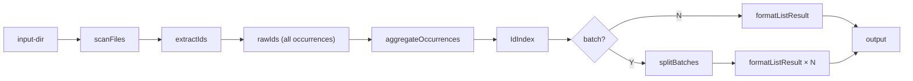

# List Mode Design

## Overview

The `list` mode extracts all traceability IDs from markdown files and outputs a
structured index with occurrence information. Unlike other modes, it focuses on
**complete enumeration** rather than clustering or searching.

## Data Flow



## Output Structure

### IdIndex (JSON)

```json
{
  "totalUniqueIds": 851,
  "totalOccurrences": 2864,
  "entries": [
    {
      "fullId": "req:apikey:security-4f7b2e#20251111a",
      "level": "req",
      "scope": "apikey",
      "semantic": "security",
      "hash": "4f7b2e",
      "version": "20251111a",
      "occurrences": [
        { "filePath": "/docs/requirements.md", "lineNumber": 42 },
        { "filePath": "/docs/spec.md", "lineNumber": 15 }
      ]
    }
  ]
}
```

### Simple

One unique fullId per line (alphabetical):

```
dsg:api:contracts-g7h8i9#20260129
dsg:data:flow-d4e5f6#20260129
req:apikey:security-4f7b2e#20251111a
```

### CSV

One row per occurrence:

```csv
FullId,Level,Scope,Semantic,Hash,Version,OccurrenceCount,FilePath,LineNumber
"req:apikey:security-4f7b2e#20251111a","req","apikey","security","4f7b2e","20251111a",2,"/docs/req.md",42
"req:apikey:security-4f7b2e#20251111a","req","apikey","security","4f7b2e","20251111a",2,"/docs/spec.md",15
```

## Sort Options

| Key      | Description                       |
| -------- | --------------------------------- |
| `fullId` | Alphabetical by full ID (default) |
| `scope`  | Group by scope, then alphabetical |
| `level`  | Group by level, then alphabetical |
| `count`  | Most occurrences first            |

## Batch Splitting

When `--batch-size N` is specified with `--output`, the output is split into
multiple files:

```
--output tmp/ids.json --batch-size 100
→ tmp/ids-001.json (entries 1-100)
→ tmp/ids-002.json (entries 101-200)
→ ...
```

Each batch file has the same `IdIndex` structure with `totalUniqueIds` and
`totalOccurrences` reflecting only that batch's entries.

## Module Structure

| Module                            | Responsibility                                           |
| --------------------------------- | -------------------------------------------------------- |
| `src/list/aggregator.ts`          | Group rawIds by fullId, sort, batch split                |
| `src/formatter/list_formatter.ts` | Format IdIndex as JSON/simple/CSV                        |
| `src/modes/list.ts`               | Orchestrate scan → extract → aggregate → format → output |
| `list.ts`                         | CLI entry point with argument parsing                    |

## CLI Options

```
deno run --allow-read --allow-write list.ts [options] <input-dir>

--format <json|simple|csv>              Output format (default: json)
--output <file>                         Output file (default: stdout)
--sort <fullId|scope|level|count>       Sort order (default: fullId)
--batch-size <number>                   Entries per batch (default: 0 = no split)
```

## Comparison with Other Modes

| Feature             | list | cluster | extract                | analyze            |
| ------------------- | ---- | ------- | ---------------------- | ------------------ |
| All IDs             | yes  | yes     | no (--ids required)    | yes                |
| Occurrences grouped | yes  | no      | yes (per requested ID) | partial            |
| JSON output         | yes  | yes     | yes                    | no (Markdown only) |
| Batch splitting     | yes  | no      | no                     | no                 |
| Clustering          | no   | yes     | no                     | yes                |
| Context lines       | no   | no      | yes                    | no                 |
