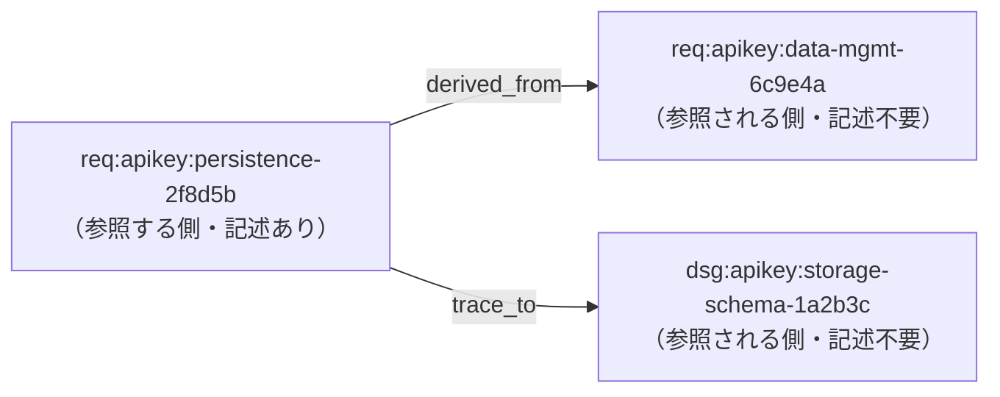

# ID 間の関係: derived_from / trace_to

Issue #2（trace_to, derived_from を抽出して Graph 化する）の前提となる定義。

## 定義

| フィールド     | 意味             | 記述する ID が指すもの             |
| -------------- | ---------------- | ---------------------------------- |
| `derived_from` | 派生元           | この項目がそこから派生した元の項目 |
| `trace_to`     | 追跡先（参照先） | この項目が追跡・参照する先の項目   |

どちらも、値はトレーサビリティ ID のリストである。

```yaml
traceability:
  - id:
      full: req:apikey:persistence-2f8d5b#20251111a
    derived_from:
      - req:apikey:data-mgmt-6c9e4a#20251111a # 派生元
    trace_to:
      - dsg:apikey:storage-schema-1a2b3c#20251112a # 追跡先（参照先）
```

## 付与の原則: 参照する側だけが書く

- `derived_from` と `trace_to` は、**参照する側**（上の例では
  `req:apikey:persistence-2f8d5b`）の項目にだけ書く。
- **参照される側**（`req:apikey:data-mgmt-6c9e4a` や `dsg:apikey:storage-schema-1a2b3c`）は、
  誰から参照されているかを知らなくてよい。逆向きのフィールド（「派生先」「追跡元」）を
  書く必要はなく、書き足して双方向を揃える運用もしない。
- 逆向きの関係（ある項目から派生した項目の一覧、ある項目を追跡先とする項目の一覧）は、
  ツールが参照する側の記述を集めて導出する。

この原則により、参照される側の文書は、後から参照が増えても変更しなくてよい。

## level の上下とは無関係

`derived_from` と `trace_to` は、level（`req`・`spc`・`dsg` など）の上位・下位を表さない。

- どの level の項目から、どの level の項目を指してもよい。同じ level 同士でもよい。
- 辺の向きは「誰が書いたか（参照する側）」だけで決まり、level の並びからは推定しない。
- analyze モードの level 定義（`UPPER_LEVELS` / `LOWER_LEVELS`）は scope ごとの level
  の揃い具合を数えるためのもので、この関係とは別物である。

## 関係の向き

関係は、参照する側から参照される側への有向の辺として扱う。



| 辺の種類       | 起点（source）  | 終点（target）        |
| -------------- | --------------- | --------------------- |
| `derived_from` | 参照する側の ID | 派生元の ID           |
| `trace_to`     | 参照する側の ID | 追跡先（参照先）の ID |

## 未決定事項

Issue #2 の実装前に決める。

- 読み取る範囲: 文書先頭の frontmatter、本文中の `` ```yaml traceability: `` ブロックのどちらか、または両方か。
  frontmatter の `derived_from` / `trace_to` の起点をどの ID とみなすか。
- 版の扱い: 版なしの参照（`...-6c9e4a`）をどの版につなぐか（最新版か、全版か）。
- 参照先が見つからない ID（リンク切れ）の報告方法。
