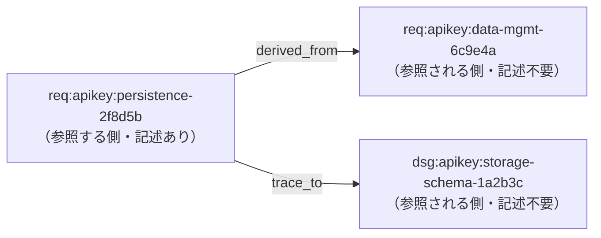

# ID 間の関係: derived_from / trace_to

Issue #2（trace_to, derived_from を抽出して Graph 化する）の定義と、graph モードでの抽出・解決の仕様。

## 定義

| フィールド     | 意味             | 記述する ID が指すもの             |
| -------------- | ---------------- | ---------------------------------- |
| `derived_from` | 派生元           | この項目がそこから派生した元の項目 |
| `trace_to`     | 追跡先（参照先） | この項目が追跡・参照する先の項目   |

どちらも、値はトレーサビリティ ID のリストである。

```yaml
traceability:
  - id:
      full: req:apikey:persistence-2f8d5b#20251111a
    derived_from:
      - req:apikey:data-mgmt-6c9e4a#20251111a # 派生元
    trace_to:
      - dsg:apikey:storage-schema-1a2b3c#20251112a # 追跡先（参照先）
```

## 付与の原則: 参照する側だけが書く

- `derived_from` と `trace_to` は、**参照する側**（上の例では
  `req:apikey:persistence-2f8d5b`）の項目にだけ書く。
- **参照される側**（`req:apikey:data-mgmt-6c9e4a` や `dsg:apikey:storage-schema-1a2b3c`）は、
  誰から参照されているかを知らなくてよい。逆向きのフィールド（「派生先」「追跡元」）を
  書く必要はなく、書き足して双方向を揃える運用もしない。
- 逆向きの関係（ある項目から派生した項目の一覧、ある項目を追跡先とする項目の一覧）は、
  ツールが参照する側の記述を集めて導出する。

この原則により、参照される側の文書は、後から参照が増えても変更しなくてよい。

## level の上下とは無関係

`derived_from` と `trace_to` は、level（`req`・`spc`・`dsg` など）の上位・下位を表さない。

- どの level の項目から、どの level の項目を指してもよい。同じ level 同士でもよい。
- 辺の向きは「誰が書いたか（参照する側）」だけで決まり、level の並びからは推定しない。
- analyze モードの level 定義（`UPPER_LEVELS` / `LOWER_LEVELS`）は scope ごとの level
  の揃い具合を数えるためのもので、この関係とは別物である。

## 関係の向き

関係は、参照する側から参照される側への有向の辺として扱う。



| 辺の種類       | 起点（source）  | 終点（target）        |
| -------------- | --------------- | --------------------- |
| `derived_from` | 参照する側の ID | 派生元の ID           |
| `trace_to`     | 参照する側の ID | 追跡先（参照先）の ID |

## 抽出と解決の仕様

graph モードが実装する。関係は既存の引数（`--skip-frontmatter`・`--versions`・`--allow-missing`）
に従って読み取り・解決し、関係専用の引数は設けない。

### 読み取る範囲

`--skip-frontmatter` に従う。ID の抽出と同じ範囲になる。

| 指定                 | 読み取る YAML 領域                                                        |
| -------------------- | ------------------------------------------------------------------------- |
| なし（既定）         | 文書先頭の frontmatter と、本文中の `` ```yaml `` / `` ```yml `` ブロック |
| `--skip-frontmatter` | 本文中の `` ```yaml `` / `` ```yml `` ブロックのみ                        |

- 領域は YAML パーサではなくインデントを見て行単位で読む。厳密には YAML として不正な文書
  （例: 値がバッククォートで始まる）でも、ID と同様に関係を取り出す。
- `derived_from` / `trace_to` の値は、インライン（`trace_to: [a, b]`）とリスト
  （`trace_to:` の下の `- a`）のどちらでもよい。値の中の ID を抽出規則（版なし ID を含む）で取り出す。

### 起点（参照する側の ID）

`derived_from` / `trace_to` を持つマッピング**自身の ID** を起点とする。

| 記述                                | 起点                       |
| ----------------------------------- | -------------------------- |
| `id: req:a:b-abc#v1`                | `req:a:b-abc#v1`           |
| `id:` の下に `full: req:a:b-abc#v1` | `req:a:b-abc#v1`           |
| 同じマッピングに `id` がない        | 起点なし（辺を作らず警告） |

- 操作の単位は ID であり、ファイルは ID が書かれている場所にすぎない。ファイルを起点の代わりに
  しない。
- 隣の項目や親の `id` を借りない。frontmatter のトップレベルに `id` がなければ、トップレベルの
  `trace_to` は起点なしとなる（例: `trace_id: REQ-2025-11-002` は ID 規約の形式ではないので起点にならない）。

### 版の扱い

`--versions` に従う（extract モードと同じ規則）。

| 参照の書き方              | `latest`（既定） | `all`        |
| ------------------------- | ---------------- | ------------ |
| 版あり（`...-6c9e4a#v1`） | その版に完全一致 | 同左         |
| 版なし（`...-6c9e4a`）    | 最新版につなぐ   | 全版につなぐ |

### 参照先の存在とリンク切れ

参照先が「存在する」とは、その ID が**関係の値の行以外**のどこか（見出し・本文・他の項目の `id` など）
に出現することをいう。`trace_to` に書いただけでは存在しない。

参照先が見つからない関係はリンク切れとして報告し、終了コードを 1 にする。

```
Broken relation: docs/a.md:22: req:a:x-abc#v1 -trace_to-> req:a:y-def#v1 (target not found)
```

| 状況                               | 終了コード |
| ---------------------------------- | ---------- |
| リンク切れなし                     | 0          |
| リンク切れあり                     | 1          |
| リンク切れあり + `--allow-missing` | 0          |

### 警告（辺を作らない記述）

| 種別            | 条件                                              |
| --------------- | ------------------------------------------------- |
| `SourceMissing` | 値のある `derived_from` / `trace_to` に起点がない |
| `InvalidTarget` | 値がトレーサビリティ ID ではない                  |

空の値（`[]`・空欄）は警告しない。警告は終了コードに影響しない。

```
Warning: docs/a.md:10: trace_to has no own ID to start from; ignored 5 target(s)
Warning: docs/b.md:24: trace_to value is not a traceability ID: us:stock:reliability
```

### グラフでの表示

- 関係は、起点から参照先への矢印として描く。色は `derived_from`（橙）、`trace_to`（青）。
- 類似度の辺と異なり、`--edge-threshold` やスライダーの影響を受けない。
- 画面の「Relations」チェックボックスで表示を切り替える。
- ノードの詳細パネルでは、関係の辺に `trace_to →`（自分が書いた）/ `← trace_to`（書かれた）を表示する。
- 同じ関係が複数箇所（frontmatter と本文の yaml ブロックなど）に書かれていても、辺は 1 本。

### 実装

| 役割                         | 場所                                       |
| ---------------------------- | ------------------------------------------ |
| 種別・ラベル・警告の型       | `src/core/relations.ts`                    |
| 抽出（YAML 領域・起点・値）  | `src/relations/extract.ts`                 |
| 解決（版・存在・リンク切れ） | `src/relations/resolve.ts`                 |
| グラフへの組み込み           | `src/modes/graph.ts`、`src/visualization/` |
